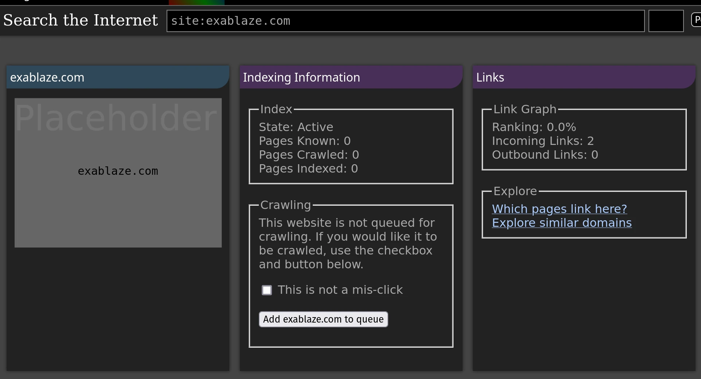

# Submit websites to be crawled by Marginalia Search

There are a few options for submitting websites for crawling by Marginalia Search.

## Option A:

If the website is already known, you can do it directly from the search engine website.

Search for your website on Marginalia Search using the search bar at the top of the page. 
Prefix the domain name with `site:`, like `site:yoursite.com`. Try also various subdomains, like `site:www.yoursite.com`. 
If it is already known by the search engine, a button will appear where you can add the site manually.

## Option B:

Fork this repository, add your site to the `sites.txt` file in this repository, and submit a pull request. The site will be added to the search engine when the next crawl is run, which may be a month or more. Be patient.

## Option B 1/2:

Create an issue in this repository with the URL of your website.  I'll add it to the list when I have the time. 

Don't be alarmed if this takes a while, as it doesn't really matter when they're loaded into the search engine database as long as it happens before the next crawling cycle begins. 

## Option C:

If you do not want to mess around with GitHub, you can also send me an email with the URL of your website. Email the website to `contact@marginalia-search.com` and I'll add it to this list.

# Why do I have to submit my website manually?

This is to prevent abuse.  Adding obstacles makes this much harder.  Otherwise it would be possible to use the search engine's crawler essentially as a weapon to disrupt a website.  

The 2020s Internet is sadly very adversarial this way.
